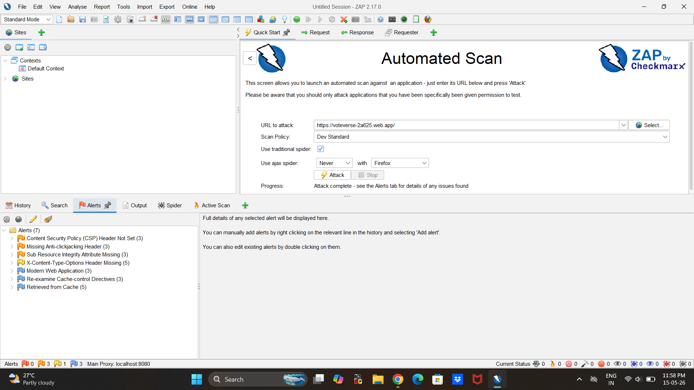
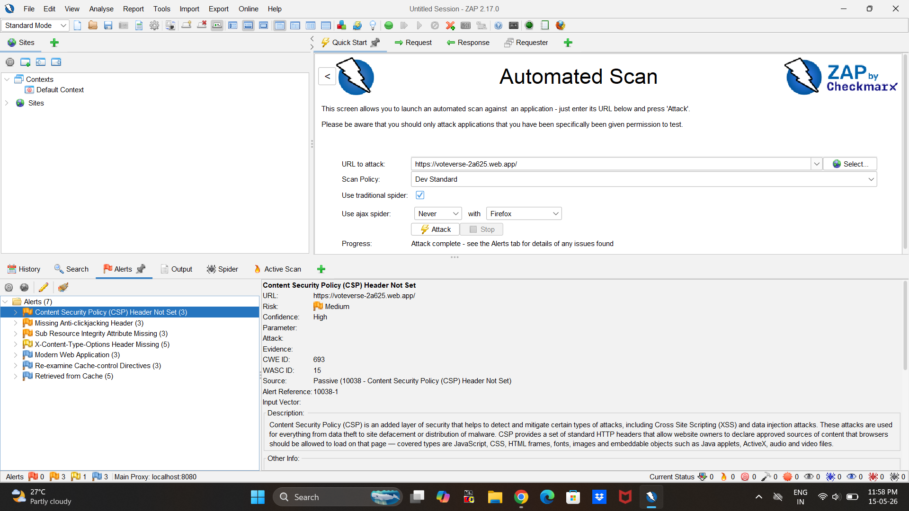

# 🔐 Vulnerability Assessment Report – VoteVerse Web Application

<div align="center">


</div>

---

## 📌 Overview

This repository contains a professional vulnerability assessment report conducted on the **VoteVerse** web application as part of the **Cyber Security Internship Program by Future Interns**.

The assessment focused on identifying browser-level security weaknesses, analyzing their potential impact, and documenting remediation recommendations using industry-standard cybersecurity practices.

---

# 🎯 Objective

The primary objectives of this assessment were:

* Identify common web application vulnerabilities
* Evaluate browser security configurations
* Analyze potential security risks
* Understand the overall security posture of the application
* Recommend remediation measures for improved security

---

# 🌐 Target Application

### VoteVerse Web Application

A futuristic voting and simulation platform developed and deployed as a live web application.

## 🔗 Target URL

```bash
https://voteverse-2a625.web.app/
```

---

# 🛠️ Tools & Technologies Used

| Tool / Technology       | Purpose                            |
| ----------------------- | ---------------------------------- |
| OWASP ZAP               | Vulnerability Assessment           |
| Browser Developer Tools | Header & Request Analysis          |
| Firebase Hosting        | Application Deployment             |
| GitHub                  | Documentation & Repository Hosting |

---

# 🔎 Assessment Scope

The assessment focused on:

* Passive vulnerability scanning
* Browser security header analysis
* Client-side security observations
* Publicly accessible application components

The assessment did **not** include:

* Exploitation attempts
* Authentication bypass testing
* Intrusive or destructive attacks

---

# 📋 Assessment Methodology

The following methodology was followed during the assessment:

1. Application reconnaissance and accessibility testing
2. Passive vulnerability assessment using OWASP ZAP
3. Security header inspection and validation
4. Risk classification and analysis
5. Documentation of findings
6. Remediation recommendation preparation

---

# ⚠️ Findings Summary

| Vulnerability                                | Risk Level |
| -------------------------------------------- | ---------- |
| Content Security Policy (CSP) Header Not Set | Medium     |
| Missing Anti-Clickjacking Header             | Medium     |
| Sub Resource Integrity Attribute Missing     | Medium     |
| X-Content-Type-Options Header Missing        | Low        |

---

# 📸 Assessment Preview

## OWASP ZAP Vulnerability Scan Overview



---

## Example Security Finding — CSP Header Not Set



---

# 🧠 Key Security Observations

The assessment identified multiple browser-level security configuration weaknesses; however, no critical vulnerabilities such as:

* SQL Injection
* Cross-Site Scripting (XSS)
* Remote Code Execution

were identified during the assessment.

This indicates that the application maintains a relatively secure foundational architecture while still requiring improvements in browser security hardening and response header protection.

---

# 📂 Repository Structure

```bash
FUTURE_CS_01
│
├── report
│   └── Raghav_Marda_Vulnerability_Assessment_Report.pdf
│
├── screenshots
│   ├── 1-csp-header.png
│   ├── 2-clickjacking-header.png
│   ├── 3-subresource-integrity.png
│   ├── 4-x-content-type-options.png
│   └── 5-overall-scan.png
│
└── README.md
```

---

# 📄 Report

The complete professional vulnerability assessment report is available in the `report` directory.

## 📌 Report File

```bash
Raghav_Marda_Vulnerability_Assessment_Report.pdf
```

---

# 📸 Evidence & Screenshots

All assessment screenshots and vulnerability evidence are available inside the `screenshots` directory.

---

# 🔐 Security Recommendations

The following improvements are recommended:

* Implement a strong Content Security Policy (CSP)
* Add Anti-Clickjacking protection headers
* Enable Subresource Integrity (SRI)
* Add X-Content-Type-Options security headers
* Improve browser-level security hardening

---

# 📚 Learning Outcome

This assessment provided practical exposure to:

* Web Application Security Testing
* Vulnerability Assessment Methodology
* OWASP ZAP Usage
* Browser Security Analysis
* Risk Classification
* Cybersecurity Reporting

---

# 👨‍💻 Author

### Raghav Marda

Cyber Security Intern – Future Interns

---

# ⭐ Disclaimer

This assessment was performed strictly for educational and internship purposes on a self-developed web application with authorized access.

No unauthorized testing, exploitation, or malicious activity was performed.
